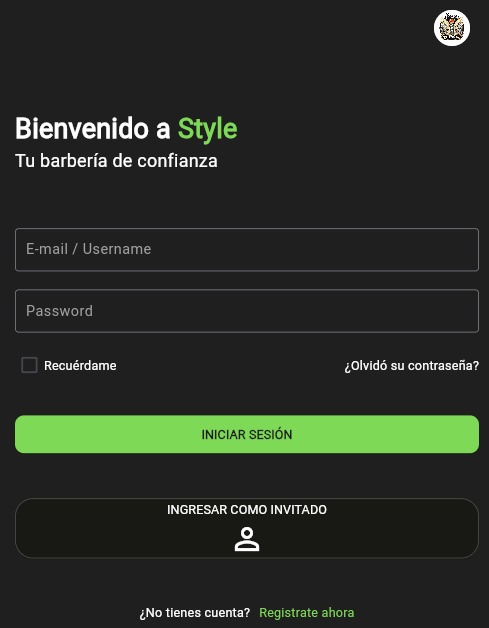

# Aplicación Móvil de Gestión de Citas | Barbería Style

Este proyecto consiste en una aplicación móvil desarrollada en **Flutter** para la gestión eficiente de citas en **Barbería Style**. La aplicación incluye un panel de control (dashboard) que permite analizar las citas realizadas y los servicios más solicitados, ayudando a optimizar los procesos internos y a mejorar la experiencia del cliente.

## Tecnologías Utilizadas

- **Lenguaje de Programación:** Dart (Flutter)
- **Framework:** Flutter
- **Base de Datos:** Firebase
- **Entorno de Desarrollo:** Android Studio / Visual Studio Code

## Requisitos

### Aplicación Móvil
- **Flutter:** Asegúrate de tener la última versión de [Flutter](https://flutter.dev/docs/get-started/install) instalada en tu sistema.
- **Android Studio** o **Visual Studio Code** para el desarrollo y ejecución de la aplicación.
- **Firebase:** Una cuenta en Firebase para gestionar la base de datos y autenticación.
